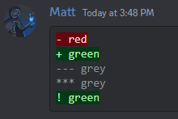

# guides
dir: C:\Users\unite\Documents\git\guides
Folder structure: 

guides
    ru # язык гайдов
        G1_Маг # <Номер Гайда> Название поста
            001_astrape.png 
            001_Доп.MD # первый пост гайда, береться картинка которая с таким же ID (001),пример 001_astrape.png 
            002_Общее.MD # второй пост
        G2_Мета # <Номер Гайда> Название поста
            001_Общее.MD
            002_Общее.MD
            003_Арбалет.MD

diff

diff